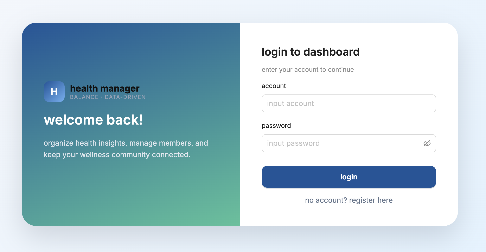
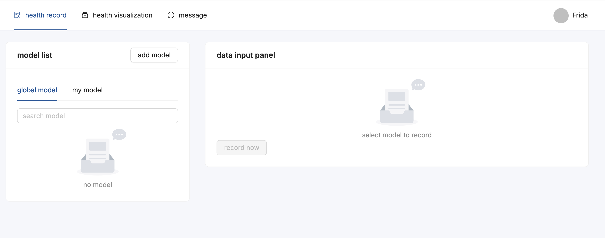
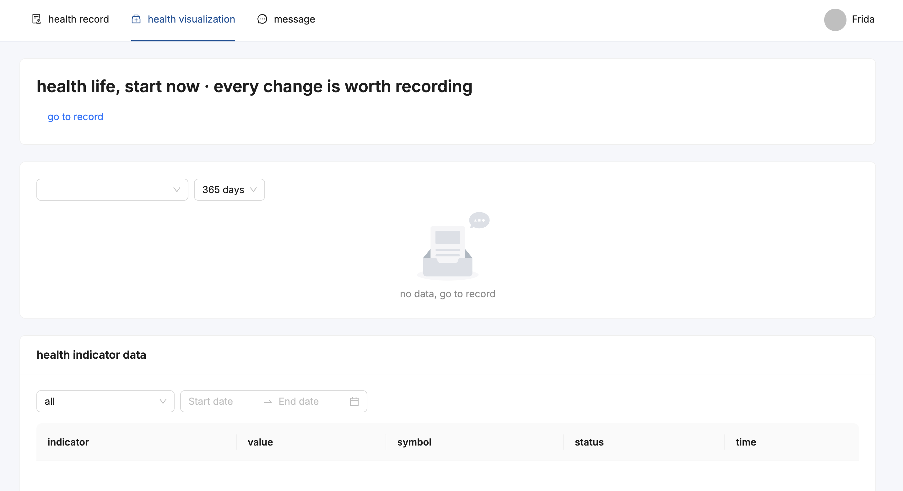

# VitalTrack

A personal health management system for tracking and monitoring health data.

## Tech Stack

### Backend
- **Framework**: ASP.NET Core 8.0
- **ORM**: Entity Framework Core 8.0
- **Database**: MySQL
- **Authentication**: JWT Bearer Authentication

### Frontend
- **Framework**: React 18
- **Build Tool**: Vite
- **UI Library**: Ant Design
- **Routing**: React Router

## Demo







## Features

- **User Management**: Registration, login, profile management
- **Health Records**: Track weight, blood pressure, heart rate, and more
- **Health Evaluation**: Health status assessment based on configurable models
- **Notifications**: System messages and health reminders
- **Data Visualization**: Charts and graphs for health metrics

## Getting Started

### Backend

1. Configure environment variables

```bash
cd backend
cp .env.example .env
```

Edit `.env` with your database credentials:

```env
DB_HOST=localhost
DB_PORT=3306
DB_NAME=vital_track
DB_USER=root
DB_PASSWORD=your-password

JWT_SECRET_KEY=your-secret-key
JWT_EXPIRATION_DAYS=7
```

2. Run the backend

```bash
dotnet restore
dotnet run --project VitalTrack.Api
```

The backend will start at `http://localhost:21090`.

### Frontend

1. Install dependencies

```bash
cd frontend
npm install
```

2. Run the frontend

```bash
npm run dev
```

The frontend will start at `http://localhost:5173`.

## API Documentation

After starting the backend, access Swagger docs at:

```
http://localhost:21090/swagger
```
